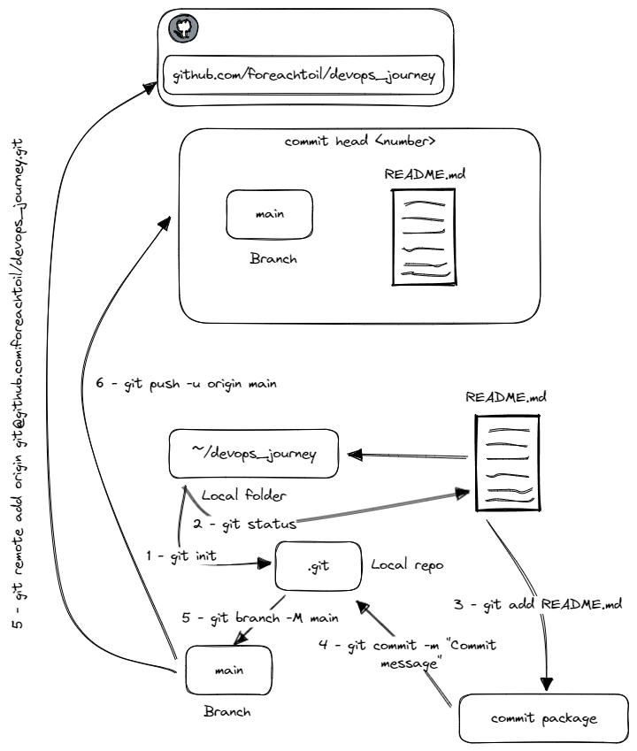

# Git
## Git Installation
1. Install Git according to your OS
   * [Windows](https://git-scm.com/download/win)
   * Linux (Debian-based) / WSL
     * `sudo apt install git-all`
   * Linux (RPM-based)
     * `sudo dnf install git-all`
   * On MacOS, just run `git --version` in the console. If it is not installed, it'll prompt for you to install it. You can also download the binary from [here](https://git-scm.com/download/mac).
## Creating a Repository
1. Go to GitHub/Gitlab/Bitbucket and create a new repository
   * [Create a new GitHub Repository](https://github.com/new) 
   * Specify the owner, repository name & description
   * Set it up as either **public** or **private**
   * Click on Create Repository
2. Create a folder in your computer
3. Go to that folder from the Terminal / CMD
4. Create a README.md file
   * Linux: `touch README.md` & Windows: `type nul > README.md`
5. Run the following commands from the same folder that you were in:
   * `git init` - This will initialize the repository by creating a .git folder that will contain a bunch of files that contains the configuration for the LOCAL git repository.
   * `git status` - This will show you the files that are not part of the git repo and that you'll need to add (in our case, it'll show `README.md`)
     * `git status -u` - This flag will show you all the files separately. Helps when you have a lots of files inside a folder and you want to see that nothing that you do not want gets commited.
   * `git add README.md` - This commands adds the file to the next commit package. You can do as well `git add .`, or use any relative path to add a bunch of files at the same time.
   * `git commit -m "Your commit message"` - This commands creates a commit with all the files that were added.
   * `git branch -M main` - This will move all the contents to a branch named main.
   * `git remote add origin git@github.com:<your-repo>.git` - This will link your local repository with the remote one that you created.
   * `git push -u origin main` - This will push the local commit to the remote that we created in the previous command.

